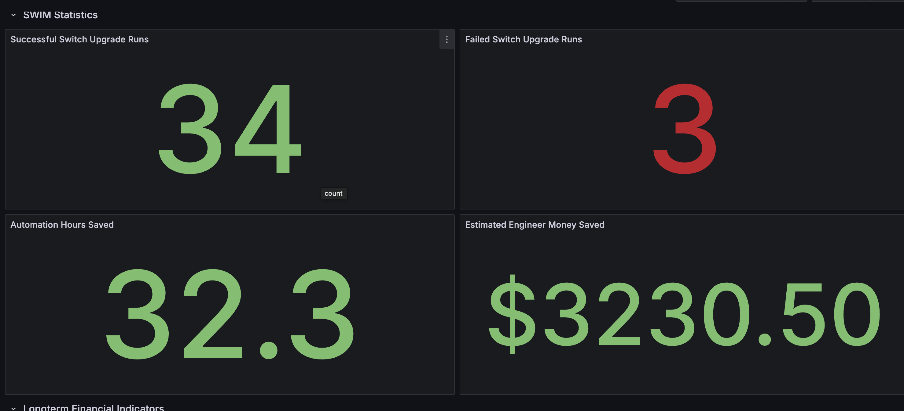

# ansiblefest2025

## How does automation pay for itself?

Consumers of automation often feel the intrinsic value in their quality of life, quality of work, and efficiency. How do automation engineers convince the people in the corner office to invest? We take a look at some basic ways to measure automation and how to use those measurements to display a correlation between automation development and business value. We start with defining what is business value? We discuss ways to define metrics and to measure automation success including, but not limited to, Ansible Automation Analytics.

The goal is to augment our existing automation development workflow with ways to measure the effectiveness. This shines a light on the business impact of automation solutions. These tools allow automation engineers to develop the tools to show that automation pays for itself.

We will look at some basic measurement principles like engineer-hours saved and correlate that to money saved.
We will explain how to do some basic measurements such as ROI.

```text
ROI = Return on Investment

TC = Total Cost
B = Benefits
NB = Net Benefits

NB = B – TC

ROI = (NB / TC) * 100
```

In the [Automation Calculator directory](automation-calculator) there are some Jupyter notebooks that do some calculations and graphing in Python.

In the [ansible-exporter directory](ansible-exporter), there is a python app that grabs data from Ansible Automation Platform and does some python calculations. It then exposes these metrics using FastAPI so that prometheus can ingest them and ultimately Grafana can display them.

The metrics published look like this:

```text

# HELP ansible_job_template_run_success Number of successful template runs
# TYPE ansible_job_template_run_success gauge
ansible_job_template_run_success 34
# HELP ansible_job_template_run_failure Number of failed template runs
# TYPE ansible_job_template_run_failure gauge
ansible_job_template_run_failure 3
# HELP ansible_job_template_hours_saved Number of hours saved by automating tasks
# TYPE ansible_job_template_hours_saved gauge
ansible_job_template_hours_saved 32.30
# HELP ansible_job_template_money_saved Amount of money saved by automating tasks
# TYPE ansible_job_template_money_saved gauge
ansible_job_template_money_saved 3230.50
# HELP ansible_job_template_irr_calc Calculated IRR for three years
# TYPE ansible_job_template_irr_calc gauge
ansible_job_template_irr_calc -57.27
# HELP ansible_job_template_roi_calc Return on Investment for project
# TYPE ansible_job_template_roi_calc gauge
ansible_job_template_roi_calc -3.00
# HELP ansible_job_template_roi_prediction Return on Investment for project
# TYPE ansible_job_template_roi_prediction gauge
ansible_job_template_roi_prediction 42.64
```

Finally, in the [playbooks directory](playbooks) there are some Ansible roles to build out a prometheus and grafana server. The Dashboard used in the lightning talk is available as a [JSON file.](playbooks/roles/update_grafana_config/files/summit-dashboard.json)


